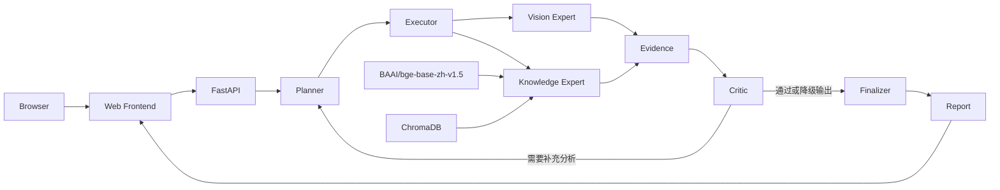

# 青穹林草智能分析系统

Qingqiong Forestry Intelligence

## 项目简介

青穹林草智能分析系统面向林草复杂场景，接收现场图片与分析需求，提供多模态辅助分析。系统以 Web 页面作为任务入口，由 FastAPI 将请求交给多智能体工作流。

工作流先规划并执行任务，再结合视觉识别与林草知识检索生成证据。质量审查节点检查分析结果，必要时触发重新规划；最终由报告生成节点整合结果，供用户查看和导出。报告属于辅助决策材料，具体结论仍需人工复核。

## 核心功能

- 上传林草场景图片，预览并填写可选的分析需求。
- Planner 拆解目标，Executor 调度任务与专业工具。
- 通过 Qwen-VL-Plus 提取图片中的视觉特征与异常线索。
- 使用 BGE 向量表示与 ChromaDB 检索相关林草知识。
- 登记视觉和知识检索证据，供后续质量审查使用。
- Critic 审查结果，证据不足时可触发重新规划。
- 通过 SSE 展示本次分析的 Agent 执行过程与状态。
- 生成最终分析报告，并在网页中查看、导出。

## 系统架构



## 项目结构

```text
Multi-Agent/
├── Agent/       # 后端与多智能体工作流
├── qingqiong/   # Web 前端
└── README.md
```

## 技术栈

Python >=3.12、FastAPI、Uvicorn、LangGraph、LangChain、DeepSeek、Qwen-VL-Plus、BAAI/bge-base-zh-v1.5、ChromaDB、HTML/CSS/JavaScript、SSE。

## 配置与启动

在本地配置 `DEEPSEEK_API_KEY` 和 `DASHSCOPE_API_KEY`。不要将密钥提交到仓库。以下命令假定已在 `Agent/.venv` 中安装项目依赖，并从项目根目录分别打开两个 PowerShell 窗口。

后端：

```powershell
cd Agent
.\.venv\Scripts\python.exe -m uvicorn api:app --host 127.0.0.1 --port 8001
```

前端：

```powershell
cd qingqiong
python -m http.server 8000
```

浏览器访问 [http://localhost:8000](http://localhost:8000)。

## 使用流程

上传图片 → 输入分析需求 → 开始分析 → 查看 Agent Timeline → 查看最终报告 → 导出报告。

## Project Status

- Git Release: v3
- Software Version: V1.0

当前版本是面向科研与大学生创新创业训练项目展示的软件原型。
